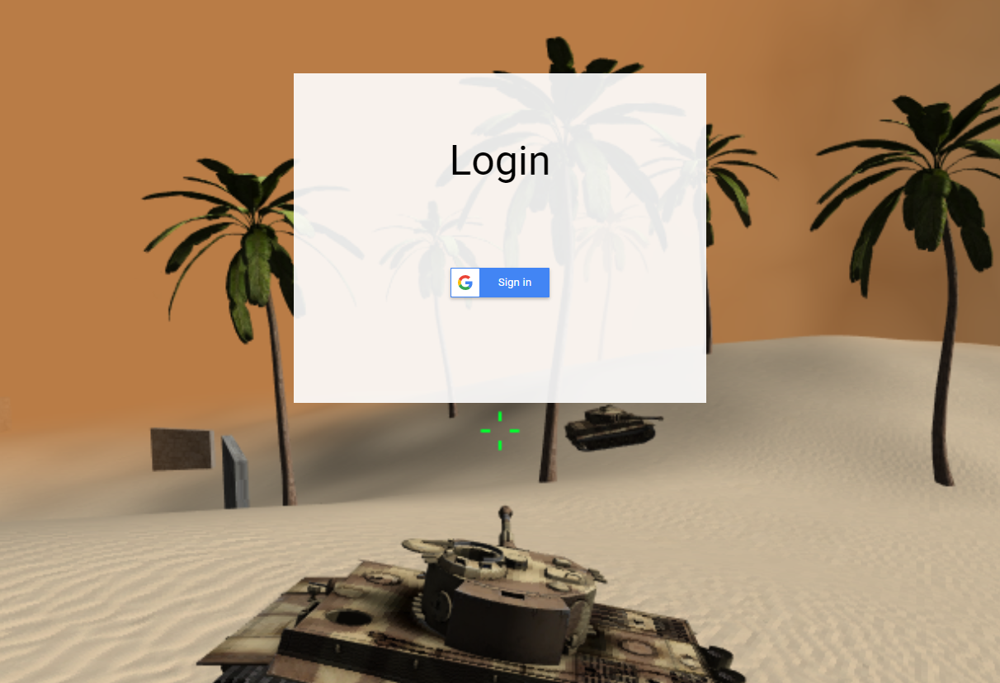

# Sprint 7 SSO Project

This project is currently live at: http://webglgame.com.s3-website.us-east-2.amazonaws.com

This is a continuation of this project:
https://github.com/CallumFerguson/CS4610FinalSpring2020

# WebGL Multiplayer Game

Mizzou CS4610 and CS4320 final project built with custom WebGL engine with Cannon.js physics.


Demo: https://youtu.be/qxom37T8zKA

(Demo video and screenshot are from an older version)

# Instructions

## Client

The client is regular javascript and requires no special setup to run. Simply host the files inside the frontend-website folder as a webserver and connect to it.

The client attempts to connect to a server on localhost:8080 by default. If it cannot connect, it starts in single player mode.

To change the server Ip search for "serverIp" in /frontend-website/game/index.js

The client uses Google Sign-In SSO. The client id is hard coded in /frontend-website/login/index.html and /frontend-website/index.html

## Server

The server is a node.js server with socket.io. To run it, run the following commands:

```sh
npm install socket.io
npm install google-auth-library
```

```sh
node server.js
```

The server uses Google Sign-In SSO to authenticate clients. The client id is hard coded in /node-sersver/server.js.

The server runs on port 8080 by default.

# Final Iteration


Login using Google


Sign into server hosted on AWS


Application gets basic data about user such as name and profile picture


In game, your profile picture hovers above your player

# Reflection

SSO is very powerful and saves a lot of development time as Google handles the authentication. In my first iteration I got basic login with Google functionality working, but it was missing server-side user authentication. Now, the server that handles the multiplayer logic and the sockets also authenticates users with Google. A user sends its id_token when it connects to the server. The server then asks Google if the id_token is valid. If it is, the user is allowed to join. If the token is not valid, the user is disconnected. Implementing this functionality without SSO would have been much more difficult.